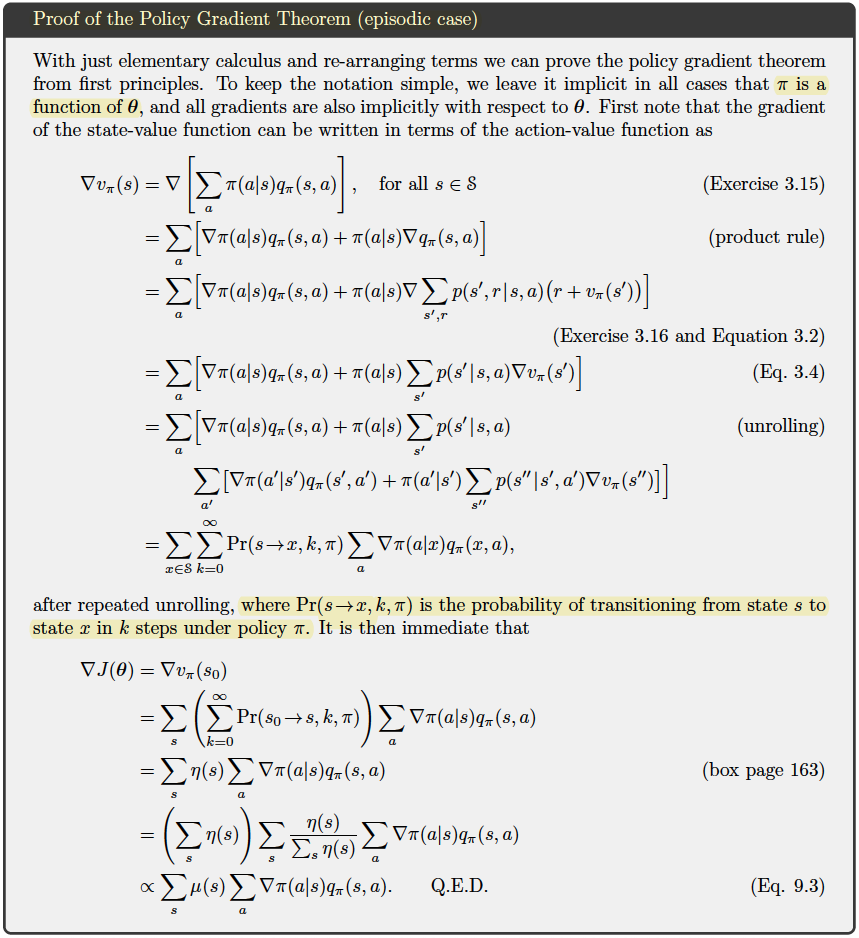
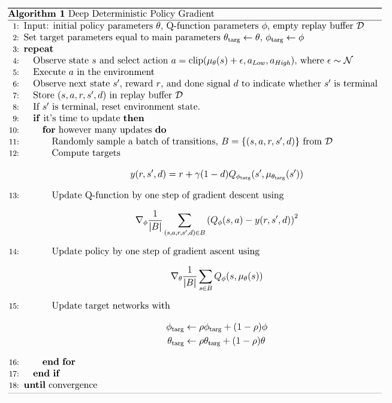

# DDPG implementation For Mountain Car

## Proof Of Policy Gradient Theorem



## DDPG



# !!! What was important:

- The random noise to help for better exploration ([Ornstein–Uhlenbeck process](https://en.wikipedia.org/wiki/Ornstein%E2%80%93Uhlenbeck_process))
- The initialization of weights ([torch.nn.init.xavier_normal_](https://pytorch.org/docs/stable/nn.init.html#torch.nn.init.xavier_normal_))
- The architecture was not big enough (just play with it a bit)
- The activation function ([ELU](https://pytorch.org/docs/stable/generated/torch.nn.ELU.html))

### DDPG net:
```

```


## Credits:

### MADDPG:

- [`simple_spread` environment](https://www.pettingzoo.ml/mpe/simple_spread)
- [PyTorch | SIGMOID](https://pytorch.org/docs/stable/generated/torch.nn.Sigmoid.html)
- [PyTorch Lightning | LIGHTNINGDATAMODULE](https://pytorch-lightning.readthedocs.io/en/latest/extensions/datamodules.html#datamodules)
- [PyTorch Lightning | MANAGING DATA](https://pytorch-lightning.readthedocs.io/en/latest/guides/data.html)
- [RealPython | How to Use Generators and yield in Python](https://realpython.com/introduction-to-python-generators/)
- Other implementations: [variant 1](https://github.com/starry-sky6688/MADDPG/blob/master/maddpg/maddpg.py), [variant 2](https://github.com/xuehy/pytorch-maddpg/blob/master/MADDPG.py), [variant 3](https://github.com/shariqiqbal2810/maddpg-pytorch/blob/master/algorithms/maddpg.py)
- []()

### DDPG:

- [DDPG | OpenAI](https://spinningup.openai.com/en/latest/algorithms/ddpg.html)
- [Environments | OpenAI](https://gym.openai.com/envs/#box2d)
- [Optimization | Pytorch-Lightning](https://pytorch-lightning.readthedocs.io/en/latest/common/optimizers.html#automatic-optimization)
- [Adam Grad - page 36 (Training NNs from Stanford's course)](http://cs231n.stanford.edu/slides/2017/cs231n_2017_lecture7.pdf)
- [Kullback–Leibler divergence (YouTube video) - great](https://www.youtube.com/watch?v=ErfnhcEV1O8&ab_channel=Aur%C3%A9lienG%C3%A9ron)
- [Deep-Reinforcement-Learning-Hands-On-Second-Edition (page 512)](https://github.com/PacktPublishing/Deep-Reinforcement-Learning-Hands-On-Second-Edition/tree/master/Chapter17)
- [1 - Deep Deterministic Policy Gradient (DDPG): Theory and Implementation | Medium](https://towardsdatascience.com/deep-deterministic-policy-gradient-ddpg-theory-and-implementation-747a3010e82f)
- [2 - DDPG implementation | Medium](https://towardsdatascience.com/deep-deterministic-policy-gradients-explained-2d94655a9b7b)
- [Policy Gradient Algorithms | Lilian Weng's Blog](https://lilianweng.github.io/lil-log/2018/04/08/policy-gradient-algorithms.html)
- [PyTorch | DATASETS & DATALOADERS](https://pytorch.org/tutorials/beginner/basics/data_tutorial.html)
- [PyTorch | SAVING AND LOADING MODELS](https://pytorch.org/tutorials/beginner/saving_loading_models.html)
- [GitHub | zzzxxxttt / pytorch_simple_RL](https://github.com/zzzxxxttt/pytorch_simple_RL)
- [A Gentle Introduction to Cross-Entropy for Machine Learning](https://machinelearningmastery.com/cross-entropy-for-machine-learning/)

## Papers:

- Multi-Agent Actor-Critic for MixedCooperative-Competitive Environments, Lowe 2020
- Deterministic Policy Gradient Algorithms, Silver 2014 [(paper)](http://proceedings.mlr.press/v32/silver14.pdf)
- Policy Gradient Methods for Reinforcement Learning with Function Approximation, Sutton 1999 [(paper)](https://proceedings.neurips.cc/paper/1999/file/464d828b85b0bed98e80ade0a5c43b0f-Paper.pdf)
- CONTINUOUS CONTROL WITH DEEP REINFORCEMENT LEARNING, Lillicrap 2016 [(paper)](https://arxiv.org/pdf/1509.02971.pdf)
- Policy Gradient Algorithms, Weng 2018


